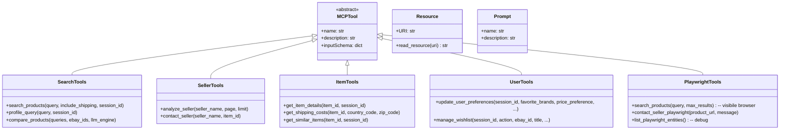

# Sprint 2 — Tools Taxonomy

## Tool Inventory

### Search Tools (search.py)
| Tool | Description |
|------|-------------|
| `search_products` | Hybrid search + RAG + LTR reranking |
| `profile_query` | LLM-based query parsing (brand, price, category) |
| `compare_products` | Parallel search + comparison matrix |

### Seller Tools (seller.py, contact_seller.py)
| Tool | Description |
|------|-------------|
| `analyze_seller` | Trust score + sentiment analysis from feedback |
| `contact_seller` | Generate direct eBay contact URL |

### Item Tools (item.py)
| Tool | Description |
|------|-------------|
| `get_item_details` | Extended item info, description, specs |
| `get_shipping_costs` | Shipping options for item → address |
| `get_similar_items` | Related items from eBay |

### User Tools (profile.py, wishlist_tool.py)
| Tool | Description |
|------|-------------|
| `update_user_preferences` | Write user preferences to DB |
| `manage_wishlist` | Add/remove/list wishlist items |

### Playwright Tools (playwright_server.py, playwright_contact.py)
| Tool | Description |
|------|-------------|
| `search_products` | Real browser navigation on eBay.it |
| `contact_seller_playwright` | Autonomous Chrome contact flow |
| `list_playwright_entities` | Debug: list all registered entities |

### Resources (resources.py)
| URI | Description |
|-----|-------------|
| `profile://{session_id}` | Full user profile + auto-learned fields |
| `wishlist://{session_id}` | User's saved items (synced to eBay Watchlist) |

### Prompts (resources.py)
| Name | Description |
|------|-------------|
| `shopping_expert_prompt` | System prompt for LLM as professional e-commerce assistant |

## Normalizers
All tools route through `app/mcp/normalizers.py` for consistent output:
- `_normalize_search_output()`
- `_normalize_seller_output()`
- `_normalize_item_details_output()`
- `_normalize_similar_items_output()`
- `_normalize_shipping_costs_output()`
- `_normalize_playwright_output()`
