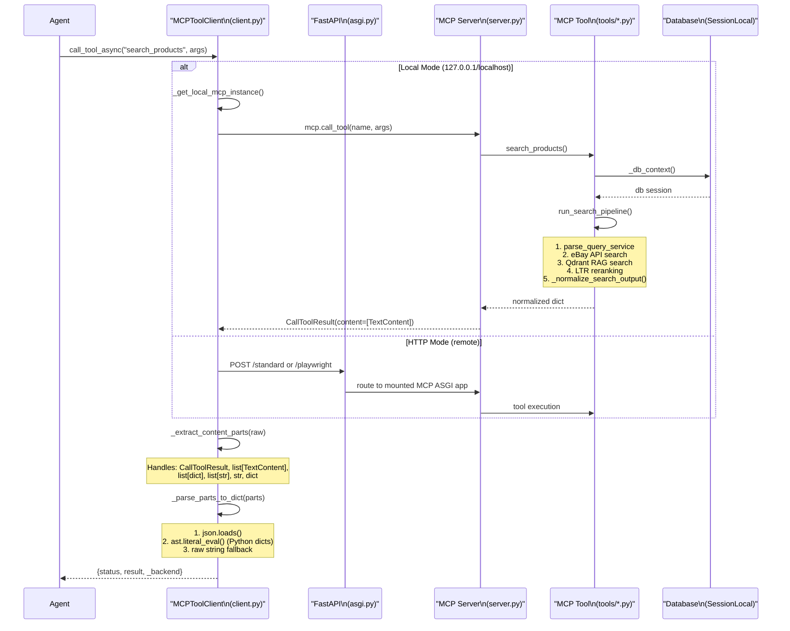

# Sprint 3 — Sequence: Tool Invocation Flow



## Key Classes

### MCPToolClient (client.py)
| Method | Purpose |
|--------|---------|
| `call_tool_async()` | Main entry point for tool invocation |
| `list_tools_async()` | Fetch tool catalog from MCP server |
| `get_tool_schemas_async()` | Fetch inputSchema for all tools |
| `read_resource_async()` | Read MCP resource by URI |
| `get_prompt_async()` | Get prompt by name |

### Mode Detection
- **Local**: `server_url` contains `127.0.0.1` or `localhost` → calls `mcp.call_tool()` directly
- **HTTP**: remote URL → uses `streamable_http_client` + `ClientSession`

## DB Context Flow
```
_tool call → _db_context() → _get_db() → DB session → tool logic → _close_db()
```
- Uses context manager to guarantee session cleanup
- `SessionLocal` factory passed at `configure_mcp()` time
