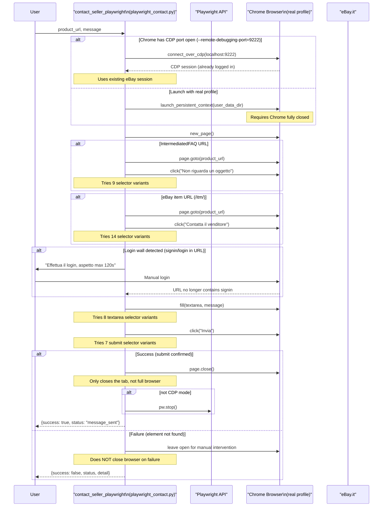

# Sprint 4 — Playwright Browser Contact Flow



## Connection Strategies

| Strategy | Condition | Pros | Cons |
|----------|-----------|------|------|
| **CDP connect** | Chrome running with `--remote-debugging-port=9222` | No need to close Chrome, preserves session | Chrome must be opened with flag |
| **Persistent context** | Default fallback | Uses real logged-in profile | Chrome must be fully closed |

## Selector Variants Tried

### "Non riguarda un oggetto" button (9 variants)
```
a:has-text('Non riguarda un oggetto')
button:has-text('Non riguarda un oggetto')
a:has-text('Not about an item')
a[href*='notAboutItem']
[data-testid*='not-about-item']
...
```

### Message textarea (8 variants)
```
textarea[name='body']
textarea[id*='message']
textarea[placeholder*='messaggio']
textarea
```

### Submit button (7 variants)
```
button:has-text('Invia')
button:has-text('Send')
input[type='submit']
button[type='submit']
```

## Error States

| Status | Cause |
|--------|-------|
| `login_required` | eBay signin wall detected, timeout after 120s |
| `contact_button_not_found` | "Non riguarda un oggetto" button not found |
| `message_form_not_found` | Textarea not found on page |
| `submit_button_not_found` | Submit button not found |
| `error` | Unexpected exception |
