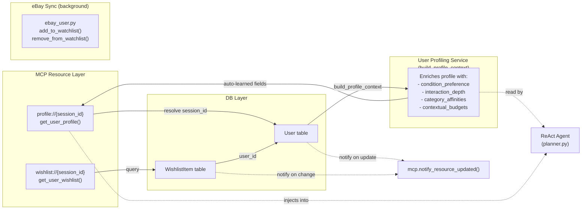

# Sprint 5 — Resource & Profile Data Flow



## Profile Resource (profile://{session_id})

**Source**: `app/mcp/resources.py` → `get_user_profile()`

### Base fields (from User table)
```python
{
    "user_id": int,
    "username": str,
    "email": str,
    "favorite_brands": str,
    "price_preference": str,
    "custom_instructions": str,
    "conversation_tone": str,   # neutral, friendly, professional, zen
    "theme": str,               # light, dark
    "language": str,            # it, en, ...
}
```

### Auto-learned fields (from `build_profile_context()`)
```python
{
    "condition_preference": str,     # new, used, refurbished (+ count)
    "interaction_depth": str,         # browser, api
    "category_affinities": list,      # ["electronics", "shoes", ...]
    "contextual_budgets": dict        # {"category": "max_price", ...}
}
```

## Wishlist Resource (wishlist://{session_id})

**Source**: `app/mcp/tools/wishlist_tool.py` → `manage_wishlist()`

| Action | DB Op | eBay Sync |
|--------|-------|-----------|
| `add` | INSERT WishlistItem | `add_to_ebay_watchlist()` (async) |
| `remove` | DELETE WishlistItem | `remove_from_ebay_watchlist()` (async) |
| `list` | SELECT all for user | — |

### Background sync (fire-and-forget)
```python
_sync_to_ebay_watchlist("add", ebay_id)  # runs in asyncio.ensure_future()
```

## MCP Resource Notifications

When user data changes, the MCP server notifies subscribed clients:

```python
await mcp.notify_resource_updated(f"profile://{session_id}")
await mcp.notify_resource_updated(f"wishlist://{session_id}")
```

This allows the frontend to refresh cached profile/wishlist data in real-time.
