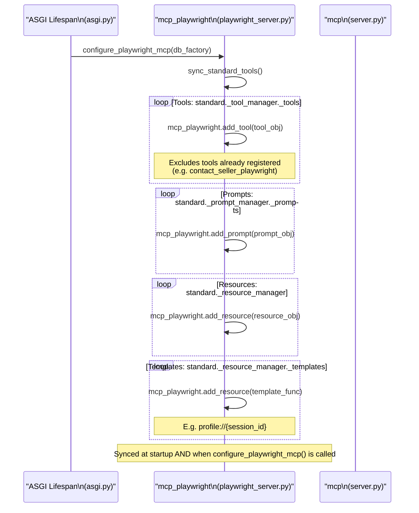

# Sprint 6 — Sync Between Worlds



## What Gets Synced

| Entity | Source | Target | Notes |
|--------|--------|--------|-------|
| `search_products` | Standard | Playwright | Both worlds have browser search |
| `analyze_seller` | Standard | Playwright | Seller analysis available in both |
| `get_item_details` | Standard | Playwright | Item lookup in both contexts |
| `profile_query` | Standard | Playwright | Query parsing in both |
| `compare_products` | Standard | Playwright | Comparison in both |
| `update_user_preferences` | Standard | Playwright | User prefs in both |
| `manage_wishlist` | Standard | Playwright | Wishlist in both |
| `contact_seller` | Standard | Playwright | Standard URL-based contact |
| `shopping_expert_prompt` | Standard | Playwright | Available in both |
| `profile://{session_id}` | Standard | Playwright | User profile resource |

## What Does NOT Sync

| Entity | Reason |
|--------|--------|
| `contact_seller_playwright` | Playwright-only (browser automation) |
| `search_products` (browser variant) | Playwright-only (real browser) |

## Sync Mechanism Details

```python
def sync_standard_tools():
    # Uses FastMCP official API
    mcp_playwright.add_tool(tool_obj.func, name=name, description=tool_obj.description)
    mcp_playwright.add_prompt(prompt_obj.func, name=name, description=prompt_obj.description)
    mcp_playwright.add_resource(resource_obj.func, uri=uri, description=resource_obj.description)
```

- Safe to call multiple times (checks `if name not in pw_tm._tools`)
- Logs: `tools=X, prompts=Y, resources=Z` after sync
- Errors on individual items are logged but don't stop the full sync

## Lifespan Order (asgi.py)

```
1. configure_mcp(db_factory=SessionLocal)
2. configure_playwright_mcp(db_factory=SessionLocal)
   → sync_standard_tools() called here
3. _standard_asgi = mcp.streamable_http_app()
4. _playwright_asgi = mcp_playwright.streamable_http_app()
5. app.mount("/standard", _standard_asgi)
6. app.mount("/playwright", _playwright_asgi)
7. Lifespan starts:
   - mcp.session_manager.run()
   - mcp_playwright.session_manager.run()
   - sync_standard_tools() called AGAIN to ensure freshness
```
